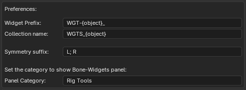

# Bone Widget

Bone Widget is a Blender add-on to assist with making custom bone shapes. It ships with a library of pre-made, common bone shapes that you can use to customize your rigs. The library can be edited, adjusted, and extended to suit your needs.

Video tutorial: [Updated Version Coming Soon](https://www.youtube.com/watch?v=OcC1melwZWk)

## Installation

1. Download the zipped code here from Github.

2. In Blender, open Preferences -> Addons -> Install. Navigate to where you saved the zip file and click install.
3. Enable the Addon with the checkbox.
4. The UI will appear in the properties panel (N-Panel) in the 3D viewport.

## Using Bone Widget

### Creating a widget

To create a widget, select a bone (or bones), choose the shape from the drop down menu, then press create.
This will create a widget object for each of the selected bones. The widget objects will be placed in the collection that is specified in the user preferences, or in an existing widget collection, if the rig has already been customized by other rigging tools.

The redo panel will appear in the bottom left of the 3D viewport. You can adjust the created widgets here by tweaking the following properties:

- **Scale**: This is the size of the widget in Blender units. If you want to make the widget relative to the size of the bone, check the **Scale to bone length** box (This will multiply the Scale by the bone length).
- **Slide**: This will slide the position of the widget along the length (Y axis) of the bone. `0.0` is at the head of the bone and `1.0` is the tail. (negative values are possible too)
- **Rotation X/Y/Z**: You can adjust the rotation of the widget at the time of creation. This can save you from having to jump into edit mode to rotate a widget to better align with your bones.

### Using an object from the scene as a widget

If you want to apply a mesh object that is already in your scene as a custom shape, press "Use Scene Object". A popup will appear asking you to select the object you want to use by either using a dropdown menu or with an eyedropper. Press "OK" to apply the selected object as a widget to all selected bones.

> [!WARNING]
> Don't use objects with many vertices, as that will eventually cause Blender to freeze!

### Editing a widget

If you want to edit the widget of a bone, select the bone and press the edit button.
This will take you to edit mode for the custom bone shape and allow you to edit it. When you're done, press "To Bone" to return to pose mode.

### Resync Widget Names

If you rename a bone, you can use the "Resync Widget Names" button to update the names of the objects in the widget collection.

> [!NOTE]
> Currently the add-on is designed to have one widget per bone. If multiple bones use the same widget, it will be renamed to the last user it finds.

### Deleting a widget

To remove the widget(s) of the currently selected bone(s), press "Clear Bone Widget". This will remove the custom shape from these bones, but the widget object will stay in the collection. To remove all widget objects that aren't being used, press the "Delete Unused Widgets" button.

### Symmetrizing Widgets

If you have a rig with a "Right" and a "Left" bone, for example "Arm_Right" and "Arm_Left", you can use the "Symmetrize Widgets" button to make the widgets the same for both bones. The widget will be mirrored along the Y axis. Bones need to have the same name, suffixed with the symmetry suffix specified in the preferences.

### Matching Bone Transforms

If the widgets get out of alignment with the location of the bone itself, this operator will snap the selected widget to the matrix of the bone. It works if you have the bone(s) selected or if you have the widget object(s) selected.

> [!NOTE]
> Currently bone widget is designed to work with a "bone scale" setting of 1.0, so this feature won't work correctly for the cases where the bone scale is not 1.

### Hide/Show Widget Collection

As the name would suggest this will toggle the visibility of the widget collection.

> [!NOTE]
> This will only toggle the visibility of the widget collection that Bone Widget will use for storing the widgets. If the rig uses multiple widget collections, you will need to toggle the visibility of the other collections manually.

## UI Panel

### Shape

This is the active shape from Bone Widget Library.
Choose the shape you want to add from the list here.

### Update Widget library

#### Add to Widget library

To add a mesh object to the library, select a mesh object and click this button.
Make sure you give that mesh object an appropriate name before adding.

#### Remove from Widget Library

This will remove the active shape from the library.
Select the shape you want to remove from the list. And click this. Boom, it is gone (forever!).

## Preferences

You can change a couple of settings to better fit your workflow and naming conventions.

- **Widget Prefix**: This is the prefix that will be added to the name of the widget object.
- **Collection Name**: This is the name of the collection that Bone Widget will use to store the widgets, if no existing widget collection is found.
- **Symmetry Suffix**: This is the suffix that Bone Widget will look for when symmetrizing widgets.
- **Panel Category**: This is the category that the Bone Widget panel will be added to in the N-Panel.

### To Do:

- [Feature] Let the user change the widget suffix to a prefix for a different naming convention (Symmetrize Widgets)
- [Feature] Extract and edit a widget? Say you're editing a rig that doesn't have mesh objects for the widgets in the file (only mesh data).
  Maybe there can be a way of extracting them and making them real objects.
- [Bug] The match Bone Transforms does not work well when the bone scale is not at 1.0
