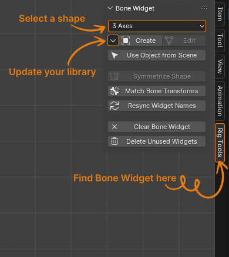
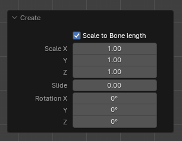

# Bone Widget

Video explanation: [Updated Version Coming Soon](https://youtube.com/@BlenderDefender)

## Description:

Bone Widget is a blender add-on to assist with making custom bone shapes. It has an editable library of shapes that make it easy to apply to any rig.

It ships with many shapes pre-made but you can also add your own to the library to make rigging easier.

## Installation:

1. Download the zipped code here from Github.

2. In Blender, open Preferences->Addons->Install. Navigate to where you saved the zip file and click install.
3. Enable the Addon with the checkbox.
4. The UI will appear in the properties panel (n panel) in the 3d viewport.

## UI Panel

### Shape:

This is the active shape from Bone Widget Library.
Choose the shape you want to add from the list here.

### BW Specials Menu:

#### Add to Widget library

To add a mesh object to the library, select a mesh object and click this button.
Make sure you give that mesh object an appropriate name before adding.

#### Remove from Widget Library

This will remove the active shape from the library.
Select the shape you want to remove from the list. And click this. Boom, it is gone (forever!).

### Creating a Widget:

#### Create:

Select a bone (or bones), choose the shape from the drop down menu, then press create.
This will create a widget object for each of the selected bones. The widget objects will be placed in the collection that is specified in the user preferences.

#### Redo panel

#### Scale to bone length:

When enabled the Global Size will be multiplied by the bone length. (ie - the widget will be relative size to the size of the bone)
With this disabled, the Global Size will be in Blender units.

#### Slide:

This will slide the position of the widget along the Y axis (or length) of the bone. 0.0 is at the head of the bone and 1.0 is the tail. (negative values are possible too)

#### Rotation X/Y/Z

You can rotate the widget by these values at the time of creation. This can save you from having to jump into edit mode to rotate a widget to better align with your situation.

#### Edit/To Bone:

When in pose mode, this will jump into edit mode for the custom bone shape and allow you to edit it.
When you have the shape selected (object or edit mode), this button will display as "To Bone". That will take you back to pose mode, if that mesh object is in face a custom shape.

**Note on Creating and Editing Shapes:**
When you 'Create' a shape, it will always be placed in the collection set in the user preferences. 
If you 'Edit' a shape, it will stay in whatever collection that widget was already located.

#### Match bone Transforms:

If the widgets get out of alignment with the location of the bone itself, this operator will snap the selected widget to the matrix of the bone. It works if you have the bone(s) selected or if you have the widget object(s) selected.

**Note:**
Currently bone widget is designed to work with a “bone scale” setting of 1.0. So this feature won't work correctly for the cases where the bone scale is not 1.

#### Resync Widget Names:

Sometimes you might rename a bone/or a widget. This operator will loop through all the custom bone shapes and make sure they match the name of the bone they are assigned to.

**Note:**
Currently the add-on is designed to have one widget per bone, if you have multiple users of the same widget, it will be renamed to the last user it finds.

#### Clear Bone Widget:

This will clear the custom bone shapes from all the selected bones.

#### Delete Unused Widgets:

This operator will loop through the widget collection and delete anything that isn't being used. This helps keep things tidy.

#### Use Selected Object:

If you want to apply a mesh object that is already in your scene as a custom shape, you can use this option.
First select the mesh shape you want to use (object mode), then shift select the armature, switch into pose mode and make sure you select any bone(s) you want this shape to be applied to. Then press the button.

#### Hide/Show Collection:

As the name would suggest this will toggle the visibility of the widget collection.
**Note:**
This will only toggle the visibility of the designated widget collection (set in the preferences). If the rig uses a

### To Do:

- complete the documentation with images to this readme file
- [Enhancement] Doesn't work well with Rigify naming scheme (solve this)
- [Feature] Let the user change the widget suffix to a prefix for a different naming convention
- [Feature] Extract and edit a widget? Say you're editing a rig that doesn't have mesh objects for the widgets in the file (only mesh data).
  Maybe there can be a way of extracting them and making them real objects.
- [Bug] The match Bone Transforms does not work well when the bone scale is not at 1.0
- [Enchantment] Rewrite the mirrorShape function so it will work when you have the mesh shape selected (not just the bone in pose mode)
